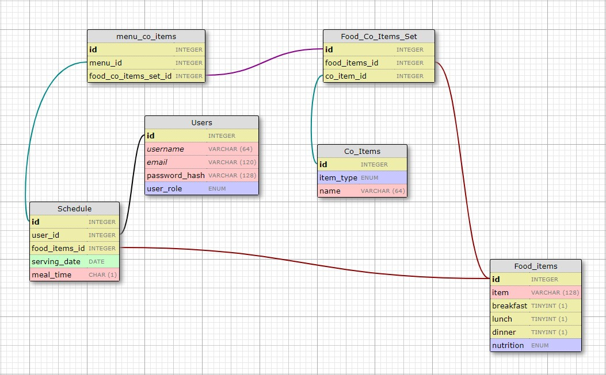

# Food Selector Project

This project takes a list of food items from an excel sheet, parses them, and randomly outputs one item based on its nutritional value and meal selected. 
I'm currently working on expanding this project to making a calendar like system where you can plan your meals for the month, and access meal history.

ER Diagram: 
